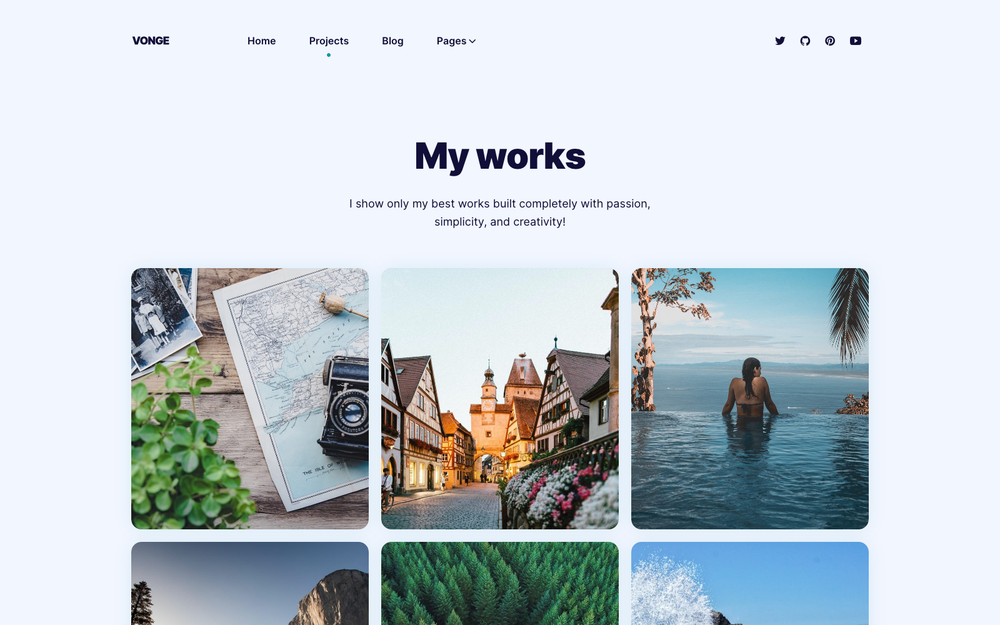

# Vonge

Vonge is a Personal portfolio/blog site template for Jekyll. Browse through a [live demo](https://jazzed-kale.cloudvent.net/).
Increase the web presence of your brand with this configurable theme.

Vonge was made by [CloudCannon](http://cloudcannon.com/), the JAMStack Cloud CMS.
The component library is built and maintained for use with [Bookshop](https://github.com/cloudcannon/bookshop/)

Find more templates, themes and step-by-step Jekyll tutorials at [CloudCannon Community](https://cloudcannon.com/community/).

## Features

* Component library for website building
* Fully configurable Website
* Pre-built pages
* Pre-styled components
* Blog
* Category pages
* Testimonials
* Portfolio
* Live editing with [CloudCannon](http://cloudcannon.com/)
* Optimised for editing in [CloudCannon](http://cloudcannon.com/)
* Search engine optimisation

## Develop

Vonge was built with [Jekyll](http://jekyllrb.com/) version 4.2.1, but should support newer versions as well.

Install the dependencies for Bookshop:

~~~bash
$ npm install
~~~

Install the Jekyll dependencies with [Bundler](http://bundler.io/):

~~~bash
$ npm run jekyll:install
~~~

Run the website:

~~~bash
$ npm start
~~~

> [!IMPORTANT]
> When running locally, the pagination will not work. Deploy to CloudCannon to see successful pagination. 